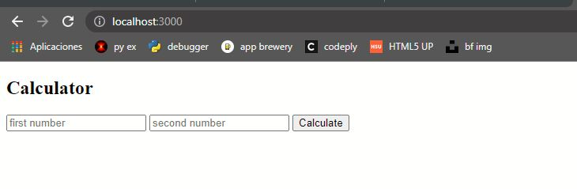
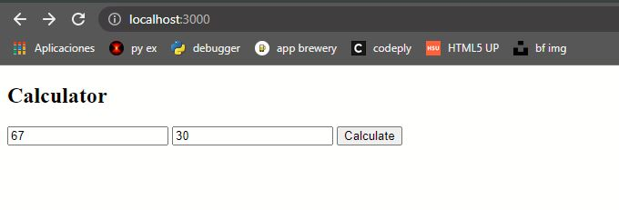
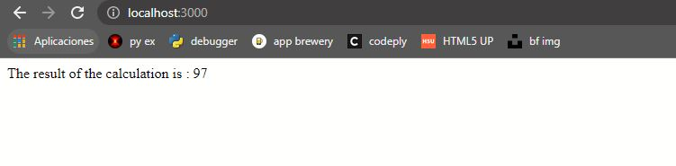
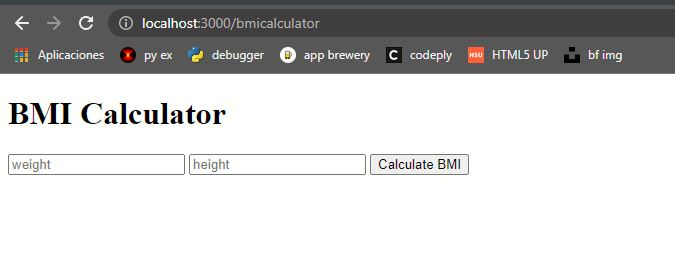
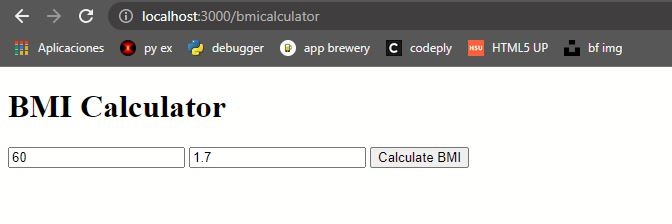
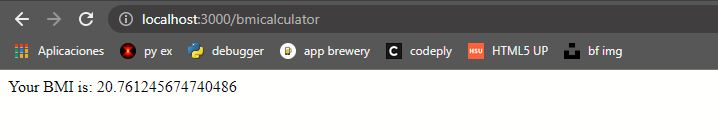
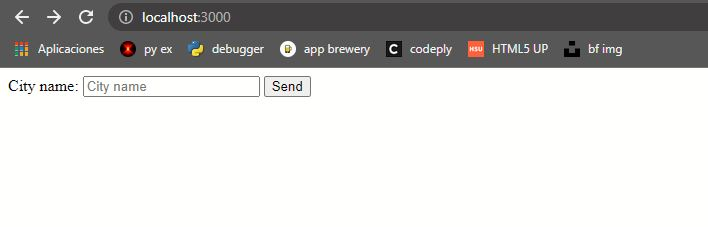
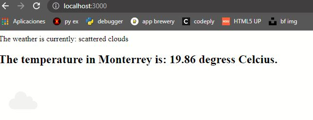

----
<h2>Calculadora</h2>

En la ruta "/" 

se ingresan los datos

se calcula el resultado de la suma

En la ruta "/bmicalculator"

se ingresan los datos

se calcula el resultado

----

<h2>WeatherProject</h2>

Se ingresa la ciudad de la que se desea recuperar datos de la API

Se muestran los resultados de la consulta

